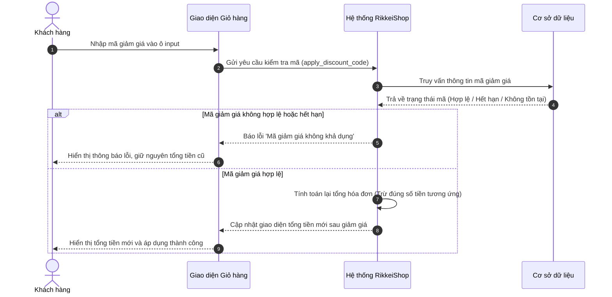

# BÁO CÁO RÀ SOÁT TỔNG HỢP BẢN THẢO SRS RIKKEISHOP - PHÂN HỆ GIỎ HÀNG & THANH TOÁN

> 👤 **Học viên:** Đỗ Hoàng Sơn | **Mã SV:** PTIT-HCM-066
> 🏫 **Môn học:** IT105-K25-Phan-tich-thi-t-k-h-th-ng

---

## 📊 Sơ đồ thiết kế hệ thống (Sequence Diagram)

> 💡 *Sơ đồ dưới đây được render tự động trực tiếp trên GitHub bằng Mermaid. Bạn cũng có thể tải file **`bt1.drawio`** trong repository này để mở và chỉnh sửa trực tiếp trên [Draw.io (diagrams.net)](https://app.diagrams.net).* 

---

## Nhiệm vụ 1: Xác định đúng vị trí IEEE 830 cho toàn bộ nội dung và sơ đồ

Dưới đây là kết quả rà soát và sắp xếp lại các thành phần nội dung, định nghĩa, danh sách Actor/Use Case và sơ đồ Sequence Diagram vào đúng cấu trúc chuẩn 3 chương của IEEE 830 đối với phân hệ 'Giỏ hàng & Thanh toán' của RikkeiShop.

- Mục A chứa định nghĩa thuật ngữ thuộc về phần '1.4 Definitions, Acronyms, and Abbreviations' của Chương 1 (Introduction), không thể đặt ở Chương 3.
- Mục B chứa các yêu cầu chức năng cốt lõi bám sát đúng phân hệ '3.2 Functional Requirements' của Chương 3 (Specific Requirements).
- Danh sách Actor và Use Case tổng thể thuộc về '3.2.1 Use Case Models / Descriptions' để phác họa rõ các tác nhân tương tác.
- Sơ đồ Sequence Diagram minh họa áp mã giảm giá (REQ-02) cần được gắn vào mục tài liệu thiết kế bổ trợ thuộc '3.2 Specific Requirements' nhằm minh họa rõ luồng thông điệp kỹ thuật.

| Nội dung | Vị trí đề xuất | Đúng/Sai — vị trí đúng nếu sai |
| --- | --- | --- |
| Mục A (định nghĩa 'Giỏ hàng') | 1.4 Definitions, Acronyms, and Abbreviations | Sai — đúng là Chương 1 (Mục 1.4 định nghĩa thuật ngữ) |
| Mục B (3 yêu cầu chức năng) | 3.2 Functional Requirements | Đúng |
| Danh sách Actor/Use Case tổng thể | 3.2 Specific Requirements (Phần Use Case Model) | Sai — đúng là đặt trong 3.2 để mô tả chi tiết các ca sử dụng |
| Sơ đồ Sequence áp mã giảm giá (minh họa REQ-02) | 3.2 Specific Requirements (Phụ lục thiết kế chức năng) | Sai — đúng là gắn kèm ngay bên dưới đặc tả REQ-02 trong 3.2 |

## Nhiệm vụ 2: Chuẩn hóa các yêu cầu chức năng theo đặc tính vàng

Trong bản thảo ban đầu, các yêu cầu REQ-02 và REQ-03 mắc lỗi vi phạm các đặc tính vàng của SRS (Cụ thể là thiếu tính 'Verifiable' và 'Complete' do mơ hồ, thiếu điều kiện biên, thiếu nhánh xử lý ngoại lệ khi mã giảm giá lỗi hoặc hệ thống thanh toán chậm trễ). Dưới đây là bảng chuẩn hóa chi tiết:

- Yêu cầu REQ-02 ban đầu chưa làm rõ tình huống người dùng nhập mã sai, mã hết hạn hoặc mã đã sử dụng, dẫn đến không thể kiểm thử (Verifiable) được các kịch bản lỗi.
- Yêu cầu REQ-03 sử dụng từ ngữ định tính 'nhanh chóng và ổn định', đây là lỗi vi phạm nghiêm trọng về tính đo lường được (Testable/Verifiable). Cần phải thay thế bằng các chỉ số SLA (Service Level Agreement) cụ thể.

| Mã | Đặc tính vàng bị vi phạm | Viết lại đạt chuẩn |
| --- | --- | --- |
| REQ-02 | Vi phạm đặc tính Complete (Thiếu kịch bản xử lý ngoại lệ khi mã không hợp lệ hoặc hết hạn) | REQ-02: Khi khách hàng nhập mã giảm giá và bấm 'Áp dụng', hệ thống kiểm tra tính hợp lệ trong CSDL. Nếu mã hợp lệ và chưa hết hạn, hệ thống trừ đúng số tiền tương ứng (hoặc theo % quy định) vào tổng hóa đơn và hiển thị thông báo thành công. Nếu mã không tồn tại, hết hạn hoặc đã được sử dụng, hệ thống phải hiển thị thông báo lỗi rõ ràng 'Mã giảm giá không khả dụng' và giữ nguyên tổng hóa đơn. |
| REQ-03 | Vi phạm đặc tính Verifiable (Dùng từ ngữ định tính 'nhanh chóng và ổn định' không đo lường được bằng kiểm thử) | REQ-03: Hệ thống phải xử lý yêu cầu thanh toán trực tuyến qua cổng thanh toán liên kết và trả về kết quả giao dịch (Thành công / Thất bại) trong vòng tối đa 5 giây dưới điều kiện mạng bình thường. Trường hợp quá thời gian timeout (15 giây), hệ thống phải tự động hủy giao dịch tạm giữ và thông báo cho khách hàng thử lại. |

---

## 📁 Danh sách tệp tin nộp bài trong Repository
- 📝 `bt1.docx`: Báo cáo tài liệu phân tích nghiệp vụ hoàn chỉnh.
- 🎨 `bt1.drawio`: File thiết kế sơ đồ chuẩn theo quy định đề bài (mở trực tiếp bằng [Draw.io](https://app.diagrams.net) hoặc Lucidchart).
